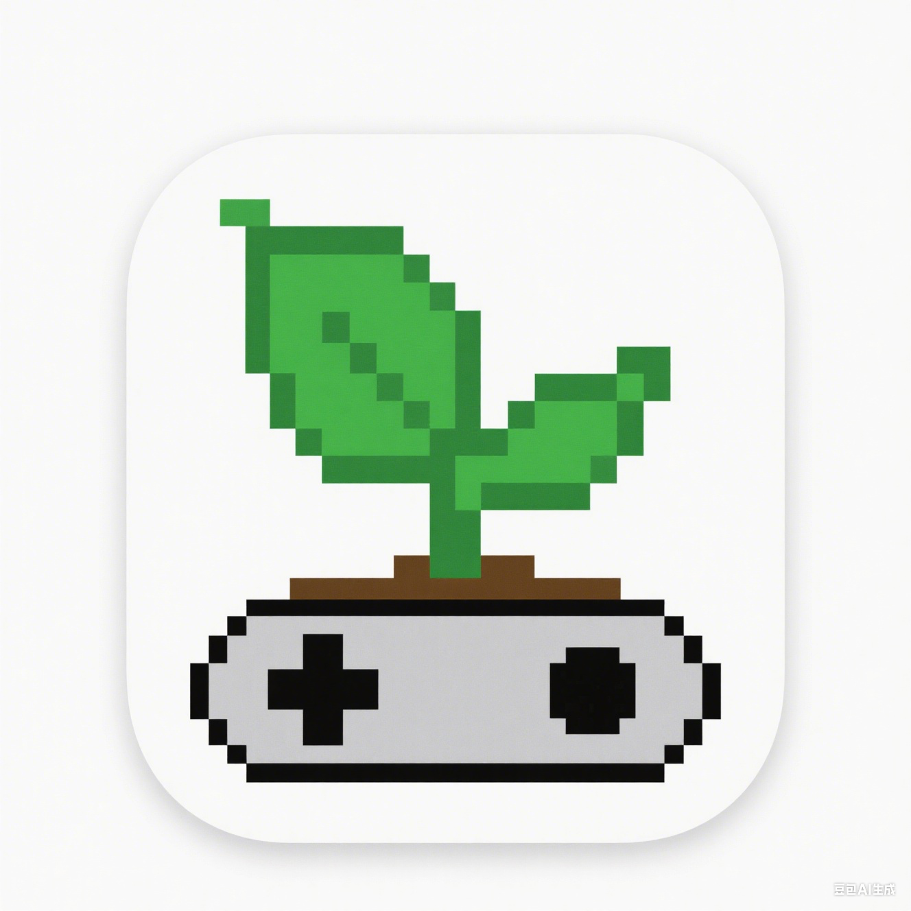

# 萌芽农场管理员控制台



一个基于 Godot 引擎开发的萌芽农场游戏远程管理控制台，支持通过 WebSocket 连接到游戏服务器进行远程管理和监控。

## 🌟 项目特色

- 🎮 **Godot 客户端**: 使用 Godot 4.4 引擎开发的现代化管理界面
- 🌐 **WebSocket 通信**: 实时双向通信，支持远程命令执行
- ⚡ **快捷命令系统**: 可自定义的快捷命令，提高管理效率
- 🔐 **安全认证**: 基于密钥的身份验证机制
- 📊 **实时监控**: 实时显示服务器状态和命令执行结果
- 🎨 **美观界面**: 彩色日志输出，直观的状态显示

## 🏗️ 项目架构

### 客户端 (Godot)
- **主控制器**: `mengya_farm_admin.gd` - 核心逻辑控制
- **连接管理**: `connect_server_panel.gd` - 服务器连接配置
- **快捷命令**: `quick_cmd_panel.gd` - 快捷命令管理
- **命令添加**: `add_quick_cmd_panel.gd` - 新增快捷命令

### 服务端 (Python)
- **游戏服务器**: `TCPGameServer.py` - 主游戏服务器
- **WebSocket API**: `WSRemoteCmdApi.py` - 远程命令接口
- **数据库管理**: `SMYMongoDBAPI.py` - MongoDB 数据操作
- **特殊农场**: `SpecialFarm.py` - 特殊农场管理系统
- **邮件服务**: `QQEmailSendAPI.py` - 邮件验证服务
- **命令系统**: `ConsoleCommandsAPI.py` - 控制台命令处理

## 🚀 快速开始

### 环境要求

#### 客户端
- Godot Engine 4.4+
- 支持 WebSocket 的网络环境

#### 服务端
- Python 3.7+
- MongoDB 数据库
- 依赖包（见 `Server/requirements.txt`）

### 安装步骤

#### 1. 克隆项目
```bash
git clone <repository-url>
cd 萌芽农场管理员控制台
```

#### 2. 服务端配置
```bash
cd Server
pip install -r requirements.txt
```

#### 3. 启动服务器
```bash
# Windows
start.bat

# Linux/macOS
./start.sh
```

#### 4. 启动客户端
1. 使用 Godot 引擎打开项目
2. 运行 `mengya_farm_admin.tscn` 场景
3. 点击「🔗 连接服务器」按钮
4. 输入服务器信息和认证密钥

## 📋 功能特性

### 🔌 连接管理
- 支持 IP 地址和端口配置
- 自动 DNS 解析优化（localhost → 127.0.0.1）
- 连接超时检测（10秒）
- 实时连接状态显示

### ⚡ 快捷命令系统
- **添加命令**: 支持命令名称、内容和参数配置
- **参数化命令**: 支持动态参数输入
- **命令确认**: 重要命令执行前确认
- **导入导出**: 快捷命令配置的备份和恢复
- **批量管理**: 支持命令的编辑和删除

### 🎨 用户界面
- **彩色日志**: 不同类型消息使用不同颜色显示
  - ✅ 成功消息 - 绿色
  - ❌ 错误消息 - 红色
  - 💡 提示消息 - 黄色
  - 🌱 欢迎消息 - 青色
  - > 用户命令 - 蓝色
- **状态指示**: 实时显示连接和认证状态
- **时间戳**: 每条消息都带有精确时间戳

### 🛡️ 安全特性
- 基于密钥的身份验证
- WebSocket 安全连接
- 命令执行权限控制
- 连接状态验证

## 🎮 服务器功能

### 🌾 农场管理
- **作物系统**: 完整的作物生长和管理
- **特殊农场**: 自动化特殊农场维护
- **杂草系统**: 智能杂草生长机制
- **偷菜系统**: 玩家互动功能

### 📊 数据管理
- **MongoDB 集成**: 高性能数据存储
- **数据缓存**: 优化的数据访问性能
- **配置管理**: 灵活的游戏配置系统
- **数据迁移**: 支持数据结构升级

### 🔧 系统功能
- **定时任务**: 自动化的系统维护
- **日志系统**: 详细的操作日志记录
- **邮件验证**: 用户邮箱验证功能
- **多环境支持**: 测试和生产环境分离

## 📁 项目结构

```
萌芽农场管理员控制台/
├── 📱 客户端文件
│   ├── mengya_farm_admin.gd          # 主控制器
│   ├── mengya_farm_admin.tscn        # 主界面场景
│   ├── connect_server_panel.gd       # 连接面板
│   ├── quick_cmd_panel.gd            # 快捷命令面板
│   ├── add_quick_cmd_panel.gd        # 添加命令面板
│   ├── project.godot                 # Godot 项目配置
│   └── icon.svg                      # 应用图标
├── 🖥️ Server/                        # 服务端目录
│   ├── TCPGameServer.py              # 主游戏服务器
│   ├── WSRemoteCmdApi.py             # WebSocket 远程API
│   ├── SMYMongoDBAPI.py              # MongoDB 数据库API
│   ├── SpecialFarm.py                # 特殊农场管理
│   ├── QQEmailSendAPI.py             # 邮件发送API
│   ├── ConsoleCommandsAPI.py         # 控制台命令API
│   ├── requirements.txt              # Python 依赖
│   ├── start.bat / start.sh          # 启动脚本
│   ├── docker-compose.yml            # Docker 配置
│   └── test/                         # 测试文件
│       ├── 特殊农场管理系统说明.md    # 特殊农场文档
│       ├── 游戏小提示配置系统说明.md  # 游戏提示文档
│       └── *.py                      # 各种测试脚本
└── 📄 README.md                      # 项目说明文档
```

## 🔧 配置说明

### 服务器配置
- **主服务器**: TCP 端口 7070
- **WebSocket API**: 端口 7071
- **认证密钥**: `mengya2024`（可在代码中修改）

### 数据库配置
- **MongoDB**: 支持测试和生产环境
- **自动环境检测**: 根据 Docker 环境自动切换
- **数据缓存**: 5分钟缓存过期时间

## 🐳 Docker 部署

项目支持 Docker 容器化部署：

```bash
cd Server
docker-compose up -d
```

## 🧪 测试

服务端提供了完整的测试套件：

```bash
cd Server/test
python test_server_mongodb.py          # 数据库测试
python test_special_farm.py            # 特殊农场测试
python test_websocket.py               # WebSocket 测试
```

## 📝 开发指南

### 添加新的快捷命令
1. 在客户端点击「➕ 添加快捷命令」
2. 填写命令名称和内容
3. 可选择是否需要参数确认
4. 保存后即可在快捷命令面板中使用

### 扩展服务器功能
1. 在 `ConsoleCommandsAPI.py` 中添加新的命令处理函数
2. 在 `WSRemoteCmdApi.py` 中注册新的命令路由
3. 更新相关文档和测试

### 自定义界面
1. 使用 Godot 编辑器打开项目
2. 修改 `.tscn` 场景文件
3. 在对应的 `.gd` 脚本中添加逻辑

## 🤝 贡献指南

欢迎提交 Issue 和 Pull Request！

1. Fork 本项目
2. 创建特性分支 (`git checkout -b feature/AmazingFeature`)
3. 提交更改 (`git commit -m 'Add some AmazingFeature'`)
4. 推送到分支 (`git push origin feature/AmazingFeature`)
5. 开启 Pull Request

## 📄 许可证

本项目采用 MIT 许可证 - 查看 [LICENSE](LICENSE) 文件了解详情。

## 🙏 致谢

- [Godot Engine](https://godotengine.org/) - 优秀的游戏引擎
- [MongoDB](https://www.mongodb.com/) - 高性能数据库
- [WebSocket](https://websockets.readthedocs.io/) - 实时通信支持

## 📞 联系方式

如有问题或建议，请通过以下方式联系：

- 📧 邮箱: [your-email@example.com]
- 🐛 问题反馈: [GitHub Issues](../../issues)
- 💬 讨论: [GitHub Discussions](../../discussions)

---

⭐ 如果这个项目对你有帮助，请给它一个星标！